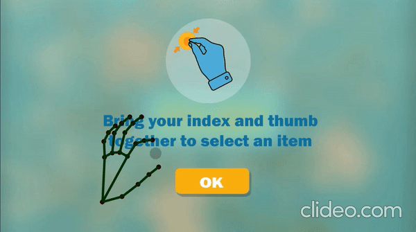
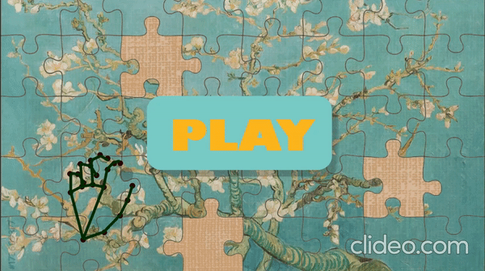
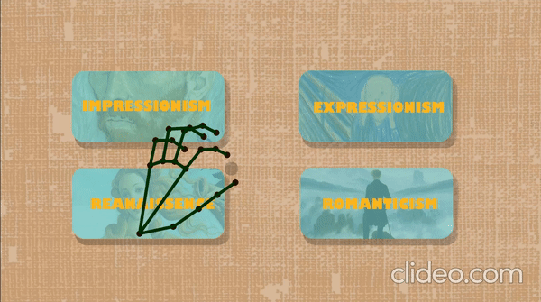
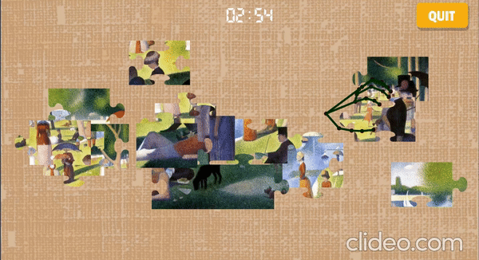
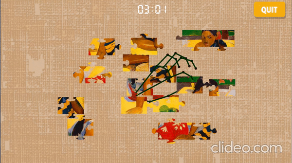
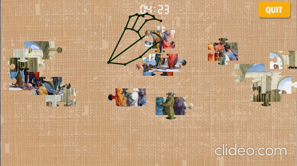
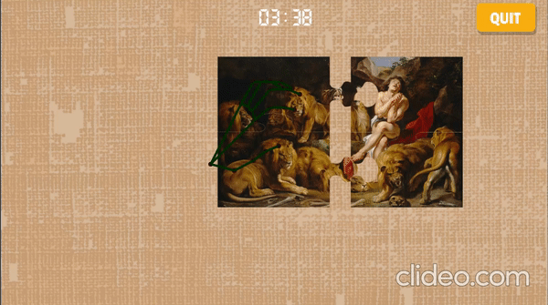

# Handzzle

**Handzzle** is a cutting-edge hand-gesture recognition puzzle game designed for art museums. By incorporating gamification principles, Handzzle offers an interactive, fun, and educational way to engage visitors of all ages with museum exhibits.

---

## Features

- **Intuitive Hand Gesture Controls**: Solve puzzles using hand gestures, powered by Mediapipe's real-time hand tracking.
- **Museum Integration**: Seamlessly integrates with art museum exhibits, making cultural learning engaging.
- **Gamification Benefits**:
  - Boosts engagement and interactivity.
  - Encourages mistake-driven learning.
  - Makes education accessible and enjoyable for all.

---

## How It Works

1. **Select a Category**: Choose from art styles like *Impressionism*, *Expressionism*, *Renaissance*, or *Romanticism*.
2. **Solve the Puzzle**: Use hand gestures to drag and drop pieces to recreate iconic paintings.
3. **Simulated Touch Inputs**: Gestures are translated into virtual touch commands, enabling smooth interaction in Unity.

---

## System Requirements

### Hardware
- Full HD screen (1920x1080 resolution).
- Full HD camera with a matching resolution.
- A computer capable of running Unity and Mediapipe.

### Software
- **Mediapipe**: For precise hand gesture detection.
- **Unity**: For game interface and mechanics.
- **Python**: To process hand gesture data and transmit it to Unity.

---

## Technology Stack

- **Mediapipe**: Handles hand landmark detection and gesture recognition with high performance.
- **Unity**: Powers the game engine and visual experience.
- **Python**: Processes hand tracking data and communicates with Unity via sockets.
- **Socket Library**: Ensures real-time data transfer between Python and Unity.

---

## Installation and Setup

1. Clone the repository:
   ```bash
   git clone https://github.com/your-repo/handzzle.git
   ```
2. Install Python dependencies:
   ```bash
   pip install mediapipe
   ```
3. Open the Unity project located in the `HandzzleUnity` folder.
4. Connect your Full HD camera and verify that the resolution matches the screen.
5. Run the Python script to activate hand tracking.
6. Launch the Unity application to start the game.

---

## Gameplay

### Instructions  
To guide users, clear visual instructions are provided on how to interact with the system.  


### Main Menu  
Begin the game by bringing your fingers together over the **Play** button.  


### Categories  
Choose one of four categories to solve puzzles related to a specific art style. Categories can be customized based on museum themes.  


#### Art Style Examples:  
- **Impressionism**  
    
- **Expressionism**  
    
- **Renaissance**  
    
- **Romanticism**  
    

---

## Testing Insights

- Younger participants adapted quickly to the game mechanics.
- Older users required additional practice but ultimately enjoyed the interactive experience.
- The simplified hand gesture interface received positive feedback across all age groups.

---

## Future Enhancements

- **Hints System**: Provide in-game assistance to help users solve challenging puzzles.
- **Painting References**: Display relevant artwork details during gameplay for deeper engagement.
- **Improved Design**: Enhance hand representations and user interface for a more immersive experience.

---

## Contributors

- **Daniel Pamfil**  
- **Adrian Cristurean Laurentiu**  
- **Carolina Proietti**  
- **Tommaso Maldera**  
- **Jorge Bernal**

---

## License

This project is licensed under the [MIT License](LICENSE).
